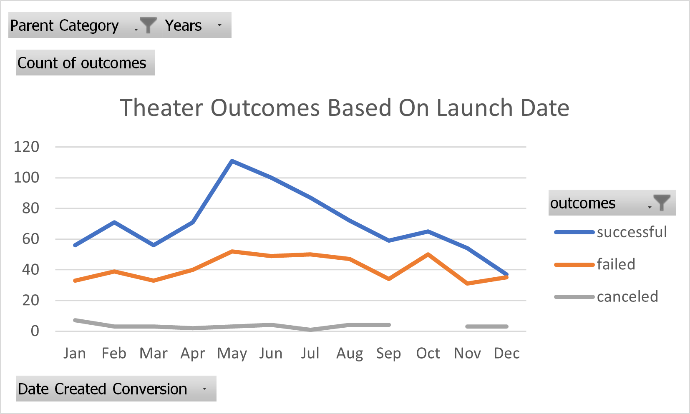
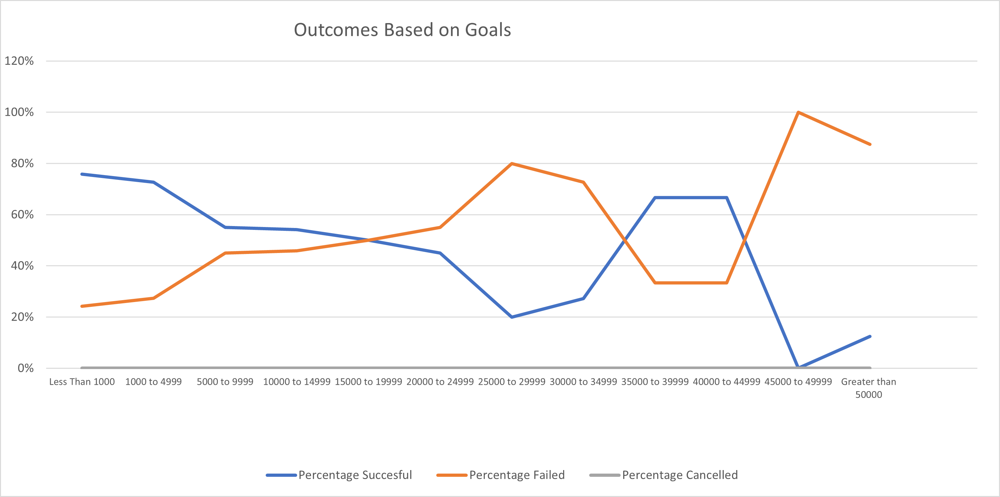

# Kickstarter Fundraising Anaysis for *Fever*

## Overview of Project
This project is an excel based analysis of Kickstarter fundraising outcomes. The data set included fundraisers from around the world across several industries and art forms. The focuse of this analysis was on the fundraisers for plays as that is the most relevant information for this project. This included looking at success by country, month of launch, total goal, and other parameters. 
### Purpose
In analyizing this data the end goal was to see the likelihood of success in the $10,000 fundraising goal. The anaylis also looked at succeses and failures by the month the Kickstarter was launched to give an additional parameter that could influence fundraising success. 
## Analysis and Challenges
We looked at several categories of info, one that was initially useful was the overall chart of US outcomes that showed a popularity and good ratio for success of funding for Theater. Overall it seems that a $10,000 kickstarter has a 55 percent chance of success. 
### Analysis of Outcomes Based on Launch Date

As seen in the chart the likelihood of success varies throughout the year. We see the highest rates of success in May and June and the lowest in December. We see that successes and failures generally track each other excepting these two times of year.

### Analysis of Outcomes Based on Goals

This chart represents the data at the core of whether or not this funding attempt is worthwhile. What is seen is the change in likelihood of success at different goal levels. The chart shows the gihhest likelihood of success in the lowest values. Then chart then has a steady decline to the $25,000 level and fluctuates heavily after that. 
### Challenges and Difficulties Encountered
The biggest challenge for a project like this is knowing which data to exclude and which to use. The variety of categories and subcategories contained created an interesting question about relvancy, essentially is a kickstarter for an American arts project more relavant than a kickstarter for an international play.

## Results

- What are two conclusions you can draw about the Outcomes based on Launch Date?
     The highest likelihood of success correlates to a late Spring to early Summer launch where you have roughly 2 successes for every failure. Although it seems that there are more successes than failures throughout the year the worst likelihood of success is a December launch. 
- What can you conclude about the Outcomes based on Goals?
    We see the best likelihood of success in asking for $5,000 or less. Asking for $5000-$25,000 or less gives roughly equal chances of success and failure but sample sizes for anything 15,000 or higher are small. 
- What are some limitations of this dataset?
    The data set provides hard numbers but not a lot of information on what the reach and level of promotion for each kickstarter was. We cannot say how much the success or failure of these campaigns relied on promotion, advertising, and networking. 
- What are some other possible tables and/or graphs that we could create?
    It would be interesting to see success rates for plays by country as support for theater can vary wildly by market. I would also be interested to see how the length of the campaign and the number of backers changed the likelihood of success.
